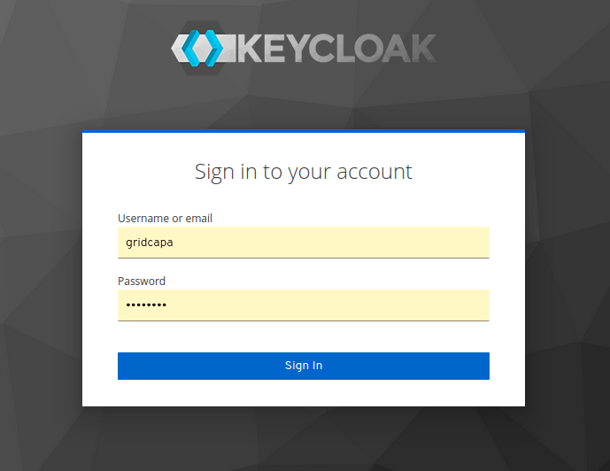
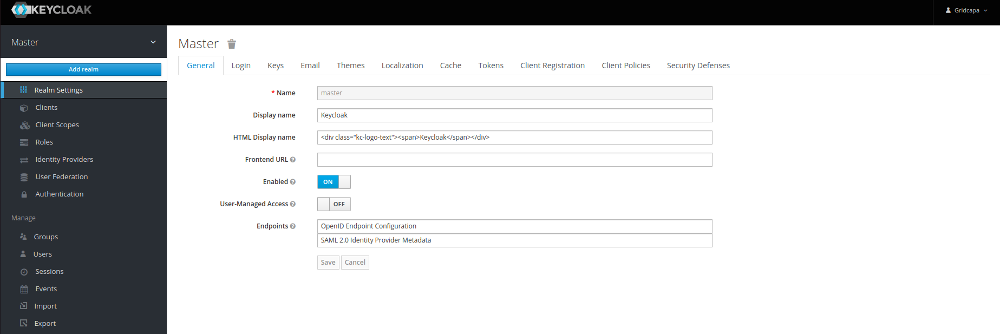
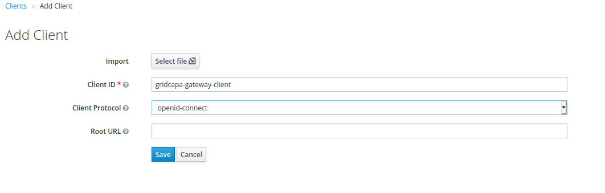
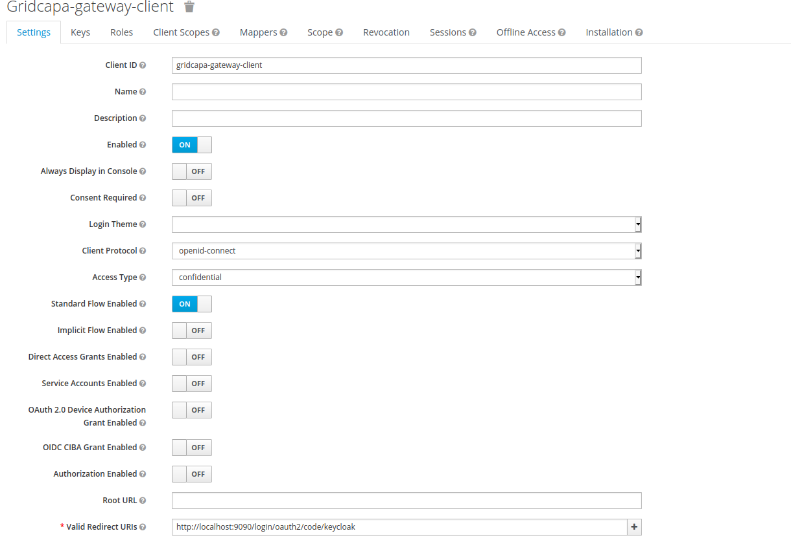
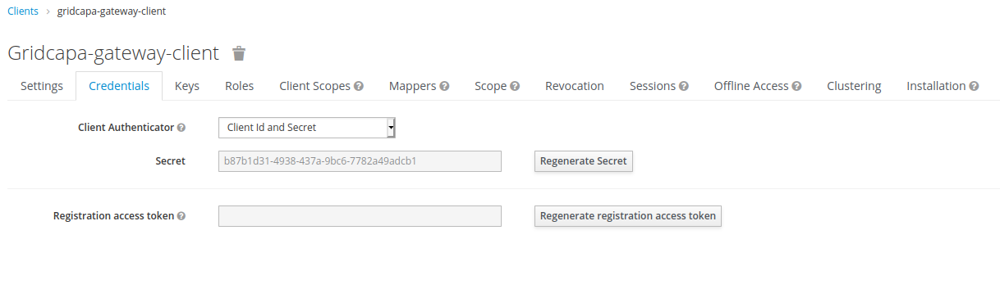
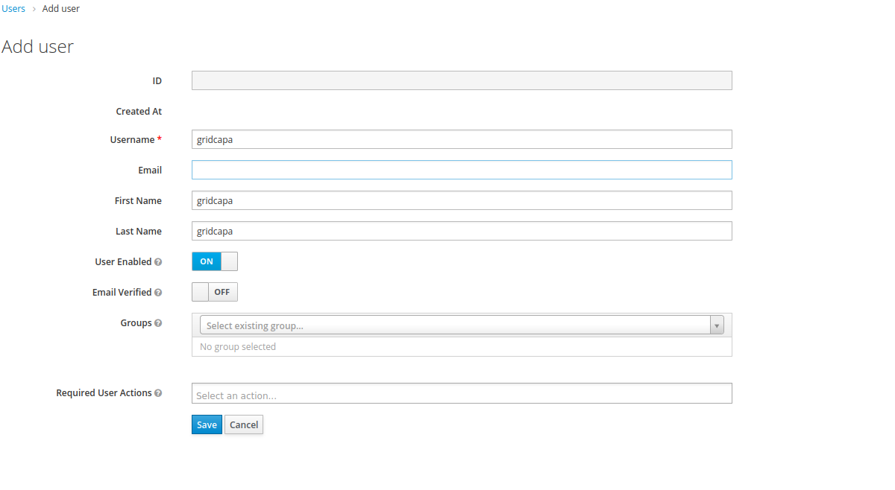
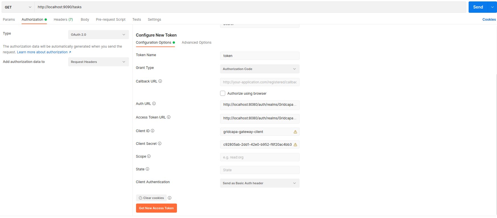

# GridCapa Gateway (Readme redaction still in progress) 

Gricapa-gateway is a not only gateway that handles routing, but it also acts as a security gate gor back end services. 
The idea is make the gateway act as an oauth2-resource server itself, so the JWT token is eagerly checked at this entry level, and not relayed to the rest of backend services.  

Any REST request to the grid-capa backend needs to have a valid JWT token in its Bearer header.

For developments, you can plug this service with an openId provider of your choice.

We choose keycloak, below an explanation step by step to set up Keycloak:

#Set up Keycloak:

In the production world, keycloak (or any RBAC) is an enterprise solution, which will be managed by another team, so all the steps explained here are just for local developments and tests.
Also in the applicative side we don't have to worry about link between the company's LDAP and the openID provider. (it must be handled in RBAC side, such is the case in keycloak).

To start Keycloak, we run a containerized image using 'docker-compose' file located in the root of this project.

Open the browser at http://localhost:6060 click on “Administration Console” and log in using “gridcapa” as the user and password (as set in the docker-compose).

Once you log in, you are already in the master realm. So create a specific realm for Gridcapa, 

Give it the name 'Gridcapa-realm', while keeping all default settings.

Next, create a client in the “Clients” section.

We will use this client to communicate with Keycloak from our Spring Cloud Gateway application.
Of course we will choose the protocol: openid-connect

Next, we will keep the “Standard Flow Enabled” option ON which allows us to use the OAuth2 mechanism. Also, we will set the “Access Type” to “confidential”, set a “Valid redirect URI” to “http://localhost:9090/login/oauth2/code/keycloak” and can leave the rest of the default settings and save this configuration.
The redirect URI refers to our Spring Cloud Gateway application, which will run at 9090.

Once you, hit save, you will get a new tab called “Credentials”. Go to the credentials section and note down the secret value.
We would use this value to register this client in our application.

This secrets will be used in configuration on the applicative side to establish the link.

Finally, lets create a user under the users section , and you will get its unique secret.

Add password under user credentials section.

#Use Postman to get a JWT token
Navigate to the Postman Authorization tab of your request. From the Type dropdown menu, select OAuth 2.0:

Click on the Get New Access Token button that will open a dialog box for configuring the identity server (Keycloak in our case). 

Fill in the appropriate fields with the corresponding values for your environment, as such:

- Token name => give any name here
- Grant Type => select Authorization Code
- Auth URL => http://{YOUR-KEYCLOAK-BASE-URL}/auth/realms/{YOUR-REALM}/protocol/openid-connect/auth
- Access Token URL => http://{YOUR-KEYCLOAK-BASE-URL}/auth/realms/{YOUR-REALM}/protocol/openid-connect/token
- Client ID => Id of a client in your Keycloak setup
- Client Secret => The generated Secret of your client in your Keycloak setup

Click on the Request Token button that should pop up a Keycloak’s login dialog if everything was set up correctly. After a successful login, a new Token should be obtained.

Click on Use Token and the content of a requested token will be automatically added as a Bearer header in a Postman request. 

If the token is expired, then repeat the token obtaining request from the Authorization tab by clicking on Get new Access Token.

